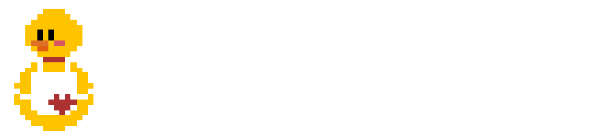

<div align="center">



<a name="readme-top"></a>

# KitchenChaos2D

A port of the famous [**CodeMonkey**][CodeMonkey] 10 hours Unity tutorial: KitchenChaos to 2D using [**GodotEngine**][godot_engine] & [**Aseprite**][aseprite_url] to make assets.

[![Godot version][godot_version_img]][godot_engine]
[![Game Version][game_version_img]][release_page]
[![License][repo_license_img]][repo_license_url]

</div>

## Table of content

- [KitchenChaos2D](#kitchenchaos2d)
  - [Table of content](#table-of-content)
  - [✨ How To Pronounce My Name](#-how-to-pronounce-my-name)
  - [📰 About](#-about)
  - [🔰 Get Started](#-get-started)
  - [💻 Code Changes](#-code-changes)
    - [GetComponent() vs GetNode()](#getcomponent-vs-getnode)
      - [GetComponent](#getcomponent)
      - [GetNode](#getnode)
    - [EventHandler vs \[Signal\]](#eventhandler-vs-signal)
  - [⚠️ License](#️-license)

## ✨ How To Pronounce My Name

My birth name is Thai, which is a Vietnamese name. I got my nick name Thaiminh2022 when I was 3 years of age playing games with a brother named Minh.

- Thai: **tie** with a **stress**.
- Minh: the word **min**

## 📰 About

- In January, [**CodeMonkey**][CodeMonkey] released one of his most comprehensive tutorial for game development for **free**.
- However, this tutorial use [**Unity**][unity_engine] as the game engine.
- This is my attempt to port the game to the godot engine in **2D**

> 📝 Notes </br>
> I create this repo to document changes I had to make to the source code for it to work with the Godot engine in case anyone have the same problem. </br>
>**If you want to know what are the changes, please prefer to the next next section**.

## 🔰 Get Started

- This repo reflects my journey of learning how to do game development using the **godot engine**.
- You are **free to use the repo as a starting point**

```bash
# HTTPS
git clone https://github.com/thaiminh2022/KitchenChaos2D.git

# github cli
gh repo clone thaiminh2022/KitchenChaos2D
```

> **! WARNING** </br>
> Some practices used in the original [**CodeMonkey**][CodeMonkey] tutorial video have to be changed because of dimension and engine differences. </br>
> **If you want to know what are the changes, please prefer to the next section**.

## 💻 Code Changes

***If you think you have better ideas for these listed problem, see contributing.***

### GetComponent() vs GetNode()

These are Unity and Godot way to basicly get the attached script of a game object, repsectively. However, there are clear differences in syntax and the way both engine work.

```cs
using UnityEngine; // GetComponent exists in UnityEngine
using Godot; // GetNode exists in Godot

// Unity
T component = GetComponent<T>();

// Godot
T node = GetNode<T>(pathToNode);
```

#### GetComponent

- Get the component attach to the current gameobject.
- If there are multiples component with the same type, it will get the first component.

> - **GetComponent returns null if there're no component, no error is thrown**
> - **GetComponent can get interface  that given to the component**

#### GetNode

- Get the children node of the node where the function is called.
- You have to specify the path, multiple component will results in the first instance.

> - **GetNode returns null if there're no component in the specified path, no error is thrown**
> - **GetNode cannot get interface  that given to the component**

**Solution** </br>
Use pattern matching instead

```cs
interface IInterface {
    // A interface
}

if (component is IInterface _interface) {
    // Do something with _interface
}
```

### EventHandler vs [Signal]

- EventHandler is a standard c# delegate use for **event**, see **Observer pattern**.
- Signal is an attribute, which is also Godot own take on **event**, use EventHandler under the hood with some differences.

```csharp
using System; // EventHandler exists in System
using Godot; // Signal exists in System  

private event EventHandler<EventArgs> OnEventHappend;

// Signal must end with EventHandler
[Signal] private delegate void EventHappenedEventHandler();
```

|   |      EventHandler      |  Signal |
|----------|:-------------:|:------:|
| Interaction with Godot Engine|  No interaction | Showed in the signal tab |
| Interaction with other nodes |    Only in C# files   |   Interact with anything using the signal tab |
| Usage in interface | Can be use in interfaces |    Cannot be used in interfaces |

I originally use signal as it was more conventional for Godot, however CodeMonkey later use EventHandler in an interface, which sinal can't so I switched back to EventHandler. </br>

## ⚠️ License

MIT

<!-- Game links -->
[godot_version_img]: https://img.shields.io/badge/Godot-4.2+-00ADD8?style=for-the-badge&logo=godotengine
[release_page]: https://github.com/thaiminh2022/kitchenchaos2d/releases
[game_version_img]: https://img.shields.io/badge/Version-0.1Beta-success?style=for-the-badge&logo=none

<!-- Author links -->

<!-- Others -->
[godot_engine]: https://godotengine.org
[unity_engine]: https://unity.com
[aseprite_url]: https://aseprite.org
[CodeMonkey]: https://youtube.com/@CodeMonkeyUnity

[repo_license_img]: https://img.shields.io/badge/LICENSE-MIT-yellow?style=for-the-badge&logo=none
[repo_license_url]: ./LICENSE
